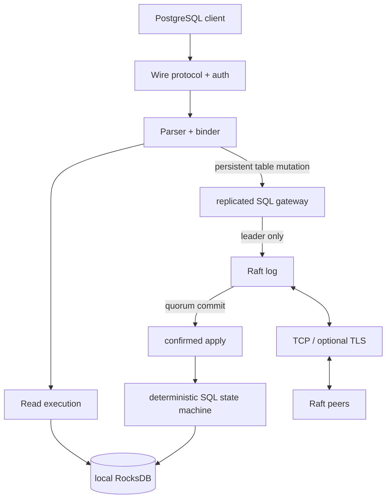

# NeuralBase

[](https://github.com/SaridakisStamatisChristos/Neuralbase/actions/workflows/ci.yml)
[](LICENSE)
[](Cargo.toml)

**NeuralBase is an experimental SQL engine in Rust** with a PostgreSQL-compatible wire endpoint, vectorized and general SQL execution paths, MVCC/RocksDB storage, an ONNX-based join-order optimizer, and a real multi-process Raft subsystem over TCP/TLS.

> [!IMPORTANT]
> NeuralBase is **pre-1.0 research/development software**. Configured fixed-membership clusters now replicate persistent table `CREATE TABLE`, `DROP TABLE`, `INSERT`, `UPDATE`, and `DELETE` through Raft and wait for quorum commit plus confirmed durable local apply before returning SQL success. This is not a production-HA claim: follower reads are local and may lag, user/auth mutations remain per-node, dynamic membership is not operator-safe, and SQL-aware snapshot/bootstrap, backup/restore, and node-replacement workflows are not implemented.

## Why this repository exists

NeuralBase is built as an evidence-driven database-engine project rather than a feature checklist. The repository emphasizes explicit semantics, bounded execution, deterministic mutation representation, adversarial tests, PostgreSQL reference comparisons, deployment safety, and clear statements about what is and is not implemented.

## Current highlights

- PostgreSQL wire protocol endpoint with authentication support.
- Parser/binder plus vectorized and row-oriented execution paths.
- Multi-table joins, subqueries, grouping, aggregates, ordering, limits, CTEs, and selected window-function execution.
- MVCC, HLC timestamps, and RocksDB persistence.
- Versioned deterministic replicated commands for persistent table DDL/DML.
- Leader-side concrete materialization of `UPDATE`/`DELETE`; followers do not re-evaluate predicates.
- Follower write rejection with leader information instead of local mutation.
- Raft acknowledgement only after quorum commit and confirmed state-machine apply for normal replicated SQL commands.
- Atomic replicated SQL effect + durable replay marker for idempotent recovery.
- RocksDB-backed Raft stable storage with fail-stop handling of required persistence failures.
- Real three-process PostgreSQL/Raft failover and restart regression coverage with independent RocksDB directories.
- ONNX DQN join-order optimizer integration.
- Docker Compose, Kubernetes StatefulSet, and Helm development deployments.
- PostgreSQL 16 row-for-row reference checks for the checked-in TPC-H Q1-Q22 suite at a small deterministic scale.
- CI gates for core tests, rustfmt/Clippy, confidence assertions, adversarial suites, TPC-H reference checks, and deployment manifests.

## Quick start

### Single node

```bash
git clone https://github.com/SaridakisStamatisChristos/Neuralbase.git
cd Neuralbase
cargo build --release --locked
NEURALBASE_DB_PATH=/tmp/neuralbase-db cargo run --release --locked
```

The SQL listener defaults to `0.0.0.0:5432`.

```bash
psql -h 127.0.0.1 -p 5432 -U neuralbase -d neuralbase
```

Without `NEURALBASE_NODE_ID`, persistent table DDL/DML uses the single-node local storage path.

### Three-process fixed-membership topology

```bash
docker compose up --build -d --wait
```

The three SQL endpoints are exposed on ports `5432`, `5433`, and `5434`. Raft communication uses explicit logical-node-ID to socket-address mappings. Each node owns an independent RocksDB directory; committed persistent table mutations are applied to each member through the replicated SQL state machine.

Clustered startup requires durable RocksDB storage. Setting `NEURALBASE_NODE_ID` without `NEURALBASE_DB_PATH`/`DB_PATH` fails startup instead of silently running a non-durable cluster.

## System shape



Mutation success is tied to Raft commit and confirmed local apply. Reads remain local; this phase does not add a linearizable follower-read protocol.

## Client write semantics

- A follower rejects persistent table mutations before proposal. This response is safe to redirect/retry against the known/current leader.
- A failure or timeout after submission to a leader is outcome-uncertain and must not be treated as proof that the mutation did not commit.
- If the client observes SQL success, the process-level crash/failover test requires that acknowledged effect to remain recoverable after leader loss.

## Capability snapshot

| Capability | Status |
|---|---|
| PostgreSQL wire endpoint | Implemented |
| Parser + binder | Implemented |
| Vectorized analytical path | Implemented |
| General joins/subqueries/aggregates | Implemented with bounded intermediates |
| TPC-H Q1-Q22 PostgreSQL 16 reference suite | Implemented at small deterministic scale |
| MVCC + HLC + RocksDB local storage | Implemented |
| Single-node persistent table DDL/DML | Implemented |
| Fixed-membership replicated persistent table DDL/DML | **Implemented and process-tested** |
| Replicated user/auth DDL | **Not implemented** |
| Raft election/log replication + durable persistence | Implemented |
| Multi-process Raft TCP transport | Implemented |
| Optional TLS transport | Feature-gated |
| Linearizable arbitrary-follower reads | **Not implemented** |
| SQL-aware Raft snapshot/bootstrap/node replacement | **Not implemented** |
| Coordinated dynamic Raft membership | **Not operator-safe yet** |
| Production SQL HA | **Not claimed** |

See [SQL support](docs/SQL_SUPPORT.md) and [Distributed semantics](docs/DISTRIBUTED.md) for the exact boundary.

## Configuration

Canonical configuration uses `NEURALBASE_*` variables. Important variables include:

- `NEURALBASE_LISTEN_ADDR`
- `NEURALBASE_DB_PATH`
- `NEURALBASE_METRICS_PORT`
- `NEURALBASE_NODE_ID`
- `NEURALBASE_RAFT_ADDR`
- `NEURALBASE_PEERS`
- `NEURALBASE_RAFT_ELECTION_TIMEOUT_MS`
- `NEURALBASE_RAFT_TLS`
- `NEURALBASE_USERS_FILE`
- `NEURALBASE_AUTH_REQUIRED`

Legacy unprefixed aliases remain accepted in selected code paths for compatibility; new deployments should use the canonical names.

## Verification

```bash
make test
make lint
make confidence
make adversarial
make tpch-correctness
```

`make tpch-correctness` starts a PostgreSQL 16 Docker reference container. CI bounds long-running suites so deadlocks fail with diagnostics rather than occupying a runner indefinitely.

Correctness evidence is not a throughput claim. Performance claims should retain exact commit, workload, scale, build, and hardware/runtime context.

## Documentation

- [Architecture](docs/ARCHITECTURE.md)
- [SQL support](docs/SQL_SUPPORT.md)
- [Distributed semantics](docs/DISTRIBUTED.md)
- [Deployment](docs/DEPLOYMENT.md)
- [Testing and evidence](docs/TESTING.md)
- [Threat model](docs/THREAT_MODEL.md)
- [Roadmap](ROADMAP.md)
- [Confidence model](CONFIDENCE.md)

## Project maturity

NeuralBase should be evaluated as an **experimental database-engine and distributed-systems repository**, not a production database product. Phase 1 closes the fixed-membership replicated table-mutation path, including deterministic effects, quorum/apply acknowledgement, fail-closed persistence, and process-level failover/restart evidence.

The next safety work is SQL-aware snapshot/bootstrap and node replacement, replicated identity state, coordinated membership changes, backup/restore, and stronger read-consistency semantics. See [ROADMAP.md](ROADMAP.md).

## License

Apache-2.0. See [LICENSE](LICENSE).
