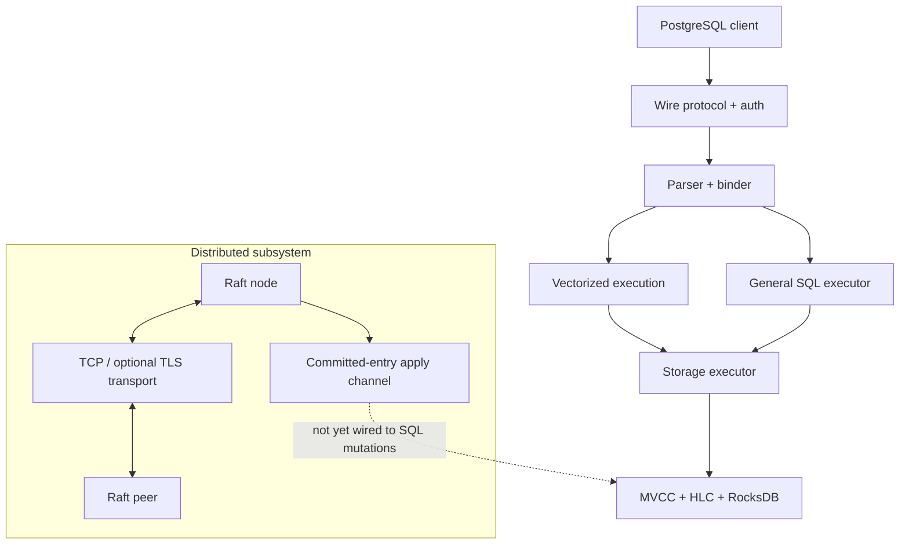

# NeuralBase

[](https://github.com/SaridakisStamatisChristos/Neuralbase/actions/workflows/ci.yml)
[](LICENSE)
[](Cargo.toml)

**NeuralBase is an experimental SQL engine in Rust** with a PostgreSQL-compatible wire endpoint, vectorized and general SQL execution paths, MVCC/RocksDB storage, an ONNX-based join-order optimizer, and a real multi-process Raft subsystem over TCP/TLS.

> [!IMPORTANT]
> NeuralBase is **pre-1.0 research/development software**. Raft consensus is implemented as a subsystem, but SQL DDL/DML is not yet committed through a replicated Raft state machine. SQL writes currently mutate each node's local RocksDB state. Do not present the current multi-node deployment as replicated SQL HA.

## Why this repository exists

NeuralBase is built as an evidence-driven database-engine project rather than a feature checklist. The repository emphasizes explicit semantics, bounded execution, adversarial tests, deterministic reference comparisons, deployment safety, and clear statements about what is and is not implemented.

### Current highlights

- PostgreSQL wire protocol endpoint with authentication support.
- Parser/binder plus vectorized and row-oriented execution paths.
- Multi-table joins, subqueries, grouping, aggregates, ordering, limits, CTEs, and selected window-function execution.
- Persistent local tables using MVCC, HLC timestamps, and RocksDB.
- Local `INSERT`, `UPDATE`, `DELETE`, table DDL, and durable user DDL.
- ONNX DQN join-order optimizer integration.
- Raft election/log replication subsystem with real TCP and optional TLS transport.
- Docker Compose, Kubernetes StatefulSet, and Helm development deployments.
- PostgreSQL 16 row-for-row reference checks for the checked-in TPC-H Q1-Q22 suite at a small deterministic scale.
- CI gates for core tests, rustfmt/Clippy, confidence assertions, adversarial suites, TPC-H reference checks, and deployment manifests.

## Quick start

### Single node

```bash
git clone https://github.com/SaridakisStamatisChristos/Neuralbase.git
cd Neuralbase
cargo build --release --locked
NEURALBASE_DB_PATH=/tmp/neuralbase-db cargo run --release --locked
```

The SQL listener defaults to `0.0.0.0:5432`.

```bash
psql -h 127.0.0.1 -p 5432 -U neuralbase -d neuralbase
```

### Three-process development topology

```bash
docker compose up --build -d --wait
```

The three SQL endpoints are exposed on ports `5432`, `5433`, and `5434`. Raft communication uses explicit logical-node-ID to socket-address mappings. Each SQL node still owns independent local storage.

## System shape



The dashed edge is the key current boundary: committed Raft entries are **not yet** the authoritative SQL mutation path.

## Documentation

| Document | Purpose |
|---|---|
| [Architecture](docs/ARCHITECTURE.md) | Component boundaries, data flow, invariants, and module map |
| [SQL support](docs/SQL_SUPPORT.md) | Supported SQL surface and known execution limits |
| [Distributed semantics](docs/DISTRIBUTED.md) | Raft transport, lifecycle, failure semantics, and non-HA boundary |
| [Deployment](docs/DEPLOYMENT.md) | Single-node, Compose, Kubernetes, Helm, TLS, auth, and configuration |
| [Testing](docs/TESTING.md) | What each CI/test gate proves and does not prove |
| [Threat model](docs/THREAT_MODEL.md) | Security assumptions and threat analysis |
| [TSAN notes](docs/TSAN.md) | Thread-sanitizer guidance |
| [Roadmap](ROADMAP.md) | Prioritized path from experimental engine to replicated database semantics |
| [Contributing](CONTRIBUTING.md) | Development setup and contribution requirements |
| [Security](SECURITY.md) | Vulnerability reporting policy |
| [Confidence model](CONFIDENCE.md) | Evidence-scoped confidence and release boundaries |

The [`docs/`](docs/) directory also contains a compact documentation index.

## Capability snapshot

| Capability | Status |
|---|---|
| PostgreSQL wire endpoint | Implemented |
| Parser + binder | Implemented |
| Vectorized analytical path | Implemented |
| General joins/subqueries/aggregates | Implemented with bounded intermediates |
| TPC-H Q1-Q22 PostgreSQL 16 reference suite | Implemented at small deterministic scale |
| MVCC + HLC + RocksDB local storage | Implemented |
| Local SQL DDL/DML | Implemented |
| Durable user DDL | Implemented per node |
| Raft election/log replication | Implemented in the Raft subsystem |
| Multi-process Raft TCP transport | Implemented |
| Optional TLS transport | Feature-gated |
| SQL mutation replication through Raft | **Not implemented** |
| Automatic replicated SQL failover | **Not implemented** |
| Coordinated dynamic Raft membership | **Not implemented as an operator-safe deployment workflow** |

See [SQL support](docs/SQL_SUPPORT.md) and [Distributed semantics](docs/DISTRIBUTED.md) for details.

## Configuration

Canonical configuration uses `NEURALBASE_*` variables. Copy `.env.example` as a starting point. Important variables include:

- `NEURALBASE_LISTEN_ADDR`
- `NEURALBASE_DB_PATH`
- `NEURALBASE_METRICS_PORT`
- `NEURALBASE_NODE_ID`
- `NEURALBASE_RAFT_ADDR`
- `NEURALBASE_PEERS`
- `NEURALBASE_RAFT_ELECTION_TIMEOUT_MS`
- `NEURALBASE_RAFT_TLS`
- `NEURALBASE_USERS_FILE`
- `NEURALBASE_AUTH_REQUIRED`

Legacy unprefixed variables remain accepted in selected code paths for compatibility; new deployments should use the canonical names.

## Verification

```bash
make test
make lint
make confidence
make adversarial
make tpch-correctness
```

`make tpch-correctness` is intentionally separate because it starts a PostgreSQL 16 Docker reference container. CI bounds the long-running suites with explicit timeouts so a blocked integration test cannot occupy a runner indefinitely.

Performance claims should only be made from the checked-in benchmark methodology and with workload/hardware context intact. Correctness evidence is not a throughput claim.

## Project maturity

NeuralBase should currently be evaluated as an **experimental database-engine and distributed-systems repository**, not a production database product. High-value remaining work is deliberately concentrated on semantics rather than feature count:

1. deterministic SQL mutation commands through Raft;
2. acknowledgement only after quorum commit and local apply;
3. fail-closed stable Raft persistence;
4. crash/restart and process-level failover proofs;
5. coordinated membership changes and operational recovery tooling.

See [ROADMAP.md](ROADMAP.md) for acceptance criteria.

## License

Apache-2.0. See [LICENSE](LICENSE).
