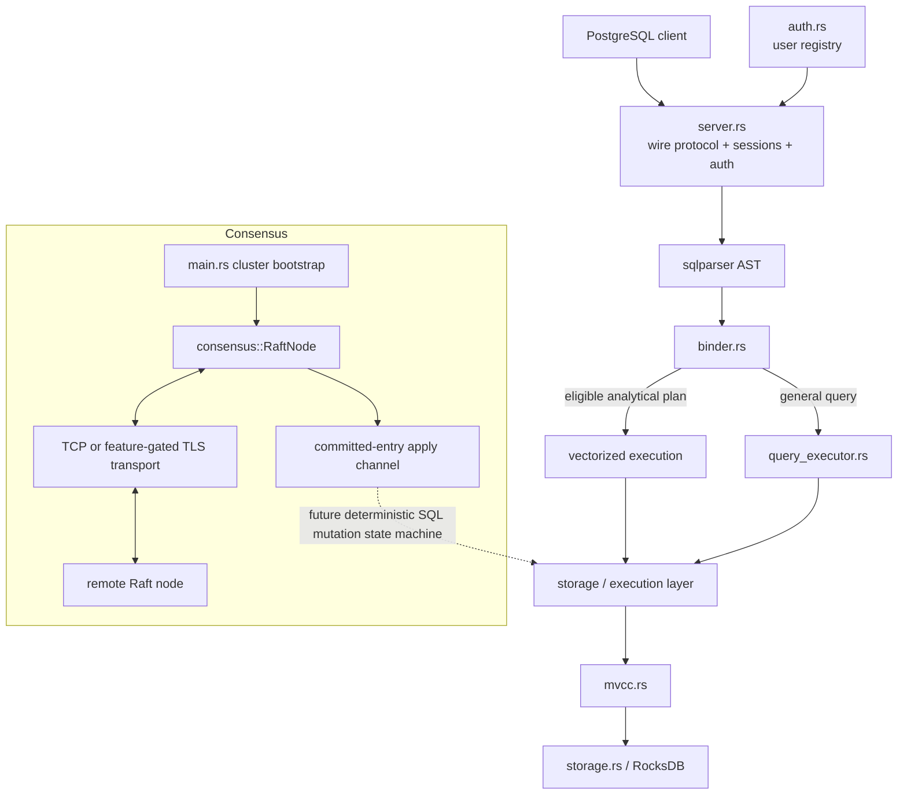
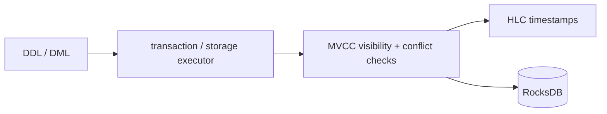

# Architecture

NeuralBase is organized as a local SQL engine plus a separate distributed-consensus subsystem. The most important architectural fact is that these two halves are **not yet joined by a replicated SQL state machine**.

## Design principles

- **Explicit semantics over implicit fallback.** Invalid peer configuration should fail rather than silently form isolated nodes.
- **Bounded work.** General query execution rejects pathological intermediate growth instead of allowing unbounded cross-join materialization.
- **Evidence-scoped claims.** Features are described according to executable tests, not architecture names alone.
- **Local durability is distinct from replicated durability.** RocksDB persistence and user-registry persistence are per-node guarantees today.
- **Backpressure is intentional, deadlock is not.** The Raft apply channel can slow commit application, while shutdown remains interruptible.

## High-level flow

## SQL front end

The server accepts PostgreSQL-protocol connections, performs session/authentication handling, parses SQL, binds referenced objects, and routes statements into the available execution paths.

The binder resolves table/column references and produces the internal bound representation used by downstream execution.

## Execution paths

### Vectorized path

The vectorized path is optimized for analytical operations represented as column vectors / record batches. It covers scan/filter/project/aggregate-style workloads and is used by benchmark and correctness suites where applicable.

### General SQL executor

`src/query_executor.rs` provides a row-oriented interpreter for broader SQL constructs. Its responsibilities include multi-table `FROM`, joins, filtering, grouping/aggregates, `HAVING`, ordering, limits/offsets, scalar and correlated subqueries, set operations, CTE resolution, scalar expressions, and selected window-function handling.

The executor applies hard budgets to intermediate materialization. Those budgets are correctness/safety controls, not query-optimizer cost estimates.

## Storage and transactions

Persistent SQL state is local to a node.

MVCC provides local snapshot-oriented visibility and conflict behavior. RocksDB provides local durable storage when `NEURALBASE_DB_PATH` is configured.

This does **not** imply replicated durability. A committed local RocksDB mutation is not automatically present on another NeuralBase node.

## Authentication state

`src/auth.rs` owns the user registry. `CREATE USER`, `ALTER USER`, and `DROP USER` mutate the registry and persist it to `NEURALBASE_USERS_FILE`.

Persistence uses a write/replace flow and the mutation path restores the previous durable registry if persistence fails, preventing a client-visible failure from leaving an unpersisted in-memory credential mutation.

Authentication state is currently per node.

## Consensus subsystem

The Raft subsystem includes:

- leader election;
- AppendEntries replication;
- request-vote traffic;
- log/snapshot/membership machinery;
- committed-entry apply delivery;
- in-process channel transport for tests;
- real TCP transport for multi-process nodes;
- feature-gated TLS transport.

Logical Raft node IDs are intentionally separate from socket addresses. Deployment configuration maps IDs such as `node2` to connectable addresses such as `node2.internal:7001`.

See [DISTRIBUTED.md](DISTRIBUTED.md) for lifecycle and failure semantics.

## Current state boundary

The architectural boundary can be stated as one invariant:

> A SQL mutation is authoritative because it was accepted by the local SQL/storage path, not because it was committed by a Raft quorum.

Therefore the current project provides a real Raft implementation and a real local SQL engine, but not yet a replicated database state machine.

## Deployment architecture

Docker Compose, Kubernetes, and Helm instantiate multiple processes with explicit Raft peer mappings. Each SQL process has its own persistent volume. Kubernetes uses a StatefulSet so pod identity can map naturally to logical Raft identity.

Horizontal auto-scaling is deliberately rejected because adding processes without coordinated Raft membership changes would create an invalid operational model.

## Module map

The most important implementation areas are:

- `src/main.rs` — process bootstrap, environment parsing, Raft startup/shutdown.
- `src/server.rs` — PostgreSQL wire/session/query dispatch and user DDL integration.
- `src/binder.rs` — SQL binding and object resolution.
- `src/query_executor.rs` — general SQL execution.
- `src/vectorized*` — vectorized execution primitives.
- `src/storage.rs` — local storage engine integration.
- `src/mvcc.rs` — MVCC transaction/visibility behavior.
- `src/auth.rs` — credential registry and persistence.
- `src/consensus/` — Raft protocol, persistence, transport, and task lifecycle.
- `tests/` — unit/integration/adversarial/reference evidence.
- `helm/neuralbase/`, `k8s/`, `docker-compose.yml` — development deployment topologies.

## Architectural acceptance rule

Any future claim of replicated SQL HA should require executable evidence that:

1. SQL mutations are encoded deterministically;
2. the leader acknowledges only after quorum commit and required local apply;
3. every committed member applies the same mutation in the same logical order;
4. restart/recovery reconstructs the same state;
5. leader failover preserves externally visible SQL state;
6. membership changes are coordinated rather than inferred from replica count.
