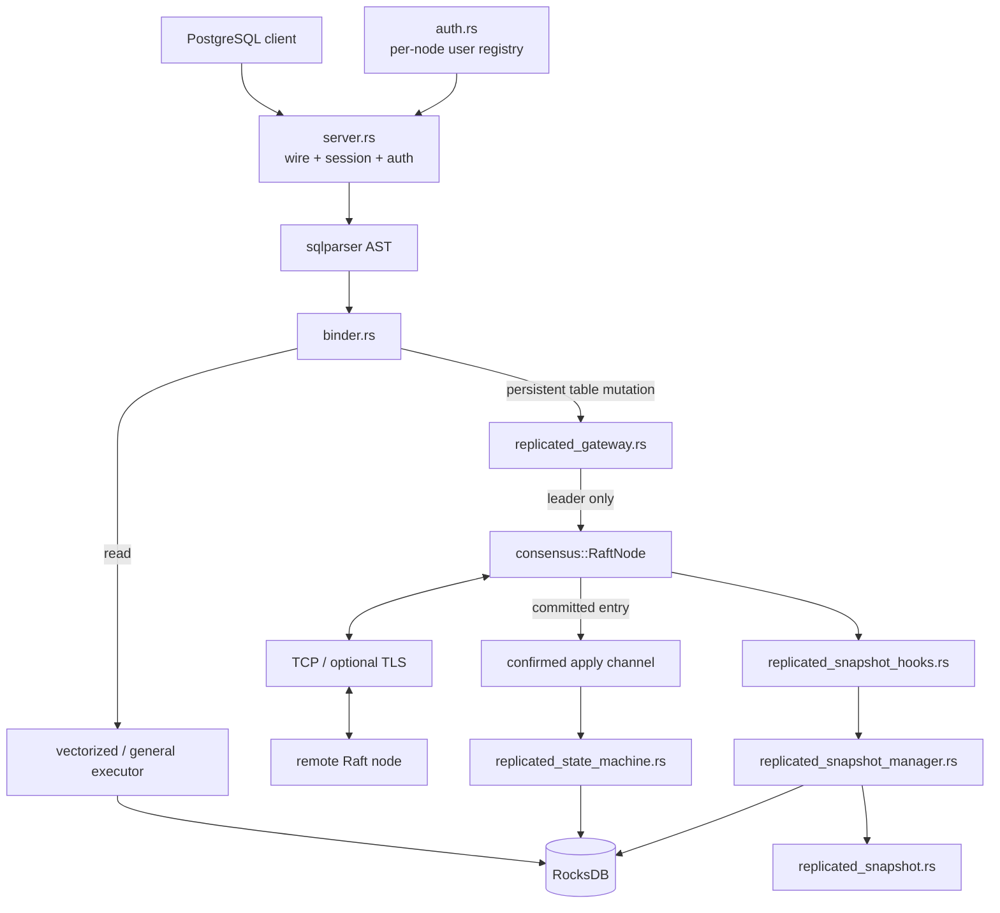

# Architecture

NeuralBase combines a local SQL engine with a Raft consensus subsystem and, in configured fixed-membership clusters, a deterministic replicated state machine for persistent table mutations plus a SQL-aware snapshot/recovery layer.

## Design principles

- **Explicit semantics over fallback.** Invalid clustered durability/catalog/persistence/snapshot prerequisites fail closed.
- **Bounded work.** General query execution and snapshot codecs enforce explicit limits.
- **Evidence-scoped claims.** Architecture names do not imply guarantees that tests do not exercise.
- **Replicated mutation effects are concrete.** Followers do not re-plan `UPDATE`/`DELETE` predicates.
- **Append is not acknowledgement.** Normal replicated SQL success waits for quorum commit plus confirmed durable local apply.
- **Snapshot before truncation.** SQL snapshot bytes are validated and durably staged before Raft prefix compaction is published.
- **Restore before acknowledgement.** A follower restores durable SQL state before acknowledging InstallSnapshot success.
- **Local reads remain local.** This phase does not claim linearizable arbitrary-follower reads.
- **Backpressure is intentional, deadlock is not.** Confirmed apply is bounded and shutdown-safe.

## High-level flow

## SQL front end and reads

The server accepts PostgreSQL-protocol connections, handles authentication/session state, parses SQL, binds referenced objects, and routes statements into execution paths.

`SELECT` remains local to the connected node. Follower reads can lag committed state because NeuralBase does not yet implement Raft ReadIndex/lease semantics.

A truly fresh fixed member has a separate Raft serving-readiness gate. Its PostgreSQL serving loop does not start until snapshot/log catch-up reaches the leader-confirmed commit point. This prevents an empty replacement from serving incomplete state; it does not make normal follower reads linearizable.

## Single-node mutation path

Without `NEURALBASE_NODE_ID`, persistent table DDL/DML keeps the historical local storage behavior.

## Clustered persistent table mutation path

Configured cluster mode requires `NEURALBASE_NODE_ID` and durable RocksDB storage.

Before persistent mutation binding/materialization, the gateway commits a current-term readiness barrier and waits for confirmed apply. Mutation materialization/proposal is serialized on the leader.

Current replicated classes are `CREATE TABLE`, `DROP TABLE`, `INSERT`, `UPDATE`, and `DELETE`. `UPDATE`/`DELETE` evaluate predicates only on the leader and replicate concrete row/key effects.

## Replicated command and state-machine layers

`src/replicated_sql.rs` defines the versioned mutation command format.

`src/replicated_state_machine.rs` applies committed commands. Its durable SQL apply marker records the highest applied SQL Raft index and replicated HLC high-water mark. Mutation effects and that marker are written atomically in one RocksDB `WriteBatch`; replay at already-applied SQL indices is idempotent.

## Raft client acknowledgement

Normal `ClientCommand` replies are not completed at local append. The leader persists, replicates, quorum-commits, delivers committed entries in order, waits for durable state-machine completion, advances `last_applied`, and only then resolves client success.

Apply failure, persistence failure, transport shutdown, or leadership loss cannot be converted into false SQL success.

## SQL-aware snapshot architecture

`src/replicated_snapshot.rs` owns a versioned deterministic logical snapshot format. It contains the Raft boundary, durable SQL apply index, replicated HLC floor, durable catalog, table IDs, primary keys and exact encoded logical row values. Ordering is canonical and the payload is bounded/checksummed.

`src/replicated_snapshot_manager.rs` owns storage export/restore:

- export reads apply metadata, catalog and rows from one RocksDB snapshot;
- restore validates before mutation;
- restore atomically replaces durable SQL catalog/data/apply marker with a `WriteBatch`;
- volatile catalog/HLC publication happens only after durable success;
- restore refuses SQL apply/HLC regression and unsupported index state.

`src/replicated_snapshot_hooks.rs` adapts the SQL snapshot manager to Raft's generic state-machine snapshot interface. Consensus knows only how to create, validate and restore bytes for an exact `(index, term)` boundary.

## Snapshot persistence ordering

Raft persistence distinguishes active snapshot state from staged snapshot transitions:

- **Creation** stage: durable candidate written before local prefix compaction. If a crash occurs before compaction publication, the durable log remains authoritative and the candidate can be discarded.
- **Installation** stage: incoming follower snapshot written before SQL restore. If a crash occurs after SQL restore but before active Raft publication, startup resumes/revalidates the staged installation and completes publication idempotently.

The RocksDB Raft store atomically publishes active state + active snapshot bytes while clearing the staged transition.

Raft retains a local suffix across InstallSnapshot only when the local boundary entry term matches the incoming snapshot term; otherwise the suffix is discarded.

## Fixed-member bootstrap/replacement

For an already-configured fixed member with empty local storage:

1. Raft starts with SQL serving closed;
2. the leader sends the SQL-aware snapshot when the member is behind the compacted prefix;
3. follower validation/staging/SQL restore completes before snapshot ACK;
4. remaining log suffix is replicated/applied;
5. a successful leader consistency exchange plus apply-through-commit opens serving readiness.

Tests then transfer leadership to the reconstructed member and prove acknowledged post-recovery writes survive its subsequent failure/restart.

This is not a dynamic membership protocol. The voter set is unchanged throughout.

## Consensus stable storage

`src/raft_persistence.rs` stores term, vote, log, active snapshot metadata/bytes and staged snapshot transitions in RocksDB. `RaftNode` fail-stops on required persistence errors; `FailClosedPersistenceStore` is defense in depth.

## Authentication state

`src/auth.rs` owns the user registry. `CREATE USER`, `ALTER USER`, and `DROP USER` remain per-node and are not included in the replicated table or SQL snapshot guarantee.

## Deployment architecture

Compose, Kubernetes and Helm still instantiate fixed-membership processes with explicit peer mappings and independent persistent volumes. Automatic HPA remains rejected because replica scaling is not a consensus membership transition.

## Module map

- `src/main.rs` — process bootstrap, clustered prerequisites, Raft/apply/snapshot startup, serving readiness and shutdown.
- `src/server.rs` — PostgreSQL protocol/session/query dispatch and local user DDL.
- `src/replicated_gateway.rs` — leader readiness, mutation serialization/materialization/proposal and catch-up gate.
- `src/replicated_sql.rs` — deterministic mutation codec.
- `src/replicated_state_machine.rs` — deterministic/idempotent RocksDB apply.
- `src/replicated_snapshot.rs` — canonical logical SQL snapshot codec.
- `src/replicated_snapshot_manager.rs` — consistent export/fail-closed restore.
- `src/replicated_snapshot_hooks.rs` — Raft/state-machine snapshot adapter.
- `src/raft_persistence.rs` — RocksDB-backed Raft active/staged snapshot storage.
- `src/consensus/` — Raft protocol, transport, confirmed apply, compaction/install/recovery lifecycle.
- `src/storage.rs`, `src/mvcc.rs` — RocksDB/MVCC storage semantics.
- `tests/replicated_sql_process.rs` — independent-process mutation failover/restart evidence.
- `tests/replicated_sql_snapshot_bootstrap.rs` — empty-storage fixed-member reconstruction/failover/restart evidence.
- `tests/replicated_sql_snapshot_cycles.rs` — repeated compaction/suffix/restart evidence.

## Current acceptance boundary

Executable evidence supports fixed-membership replicated persistent table mutations plus SQL-aware compaction and empty-storage recovery of an existing fixed logical member. Stronger HA claims still require coordinated membership changes, a replicated/strongly consistent auth design, defined stronger read-consistency modes, backup/restore/disaster recovery, broader chaos/upgrade validation and production performance characterization.
