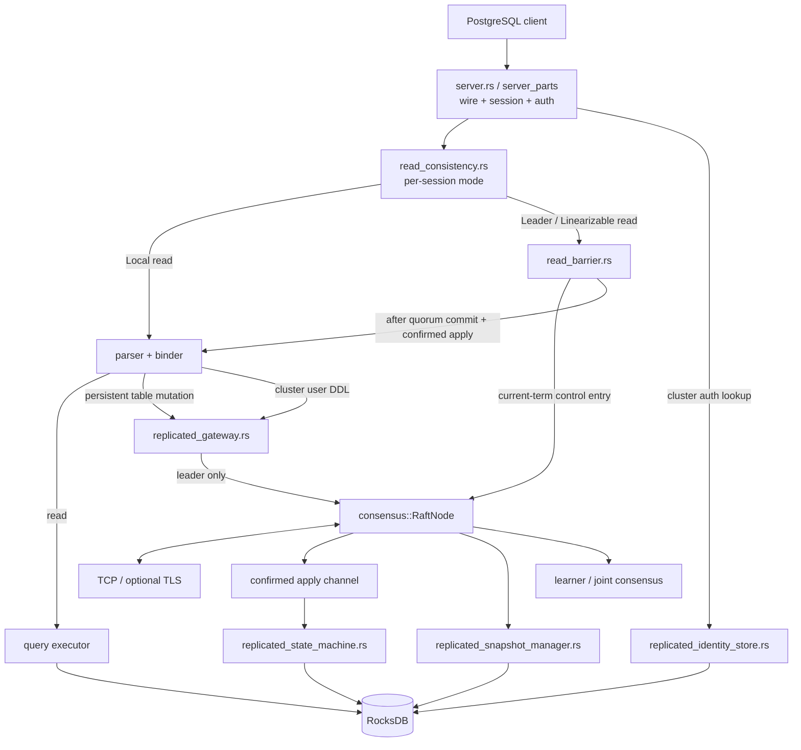

# Architecture

NeuralBase combines a local SQL engine with a Raft consensus subsystem and deterministic replicated state machines for persistent table mutations and clustered identity. SQL-aware snapshots preserve the same authoritative replicated state across compaction, recovery and learner bootstrap. Phase 6 adds an explicit session-scoped read-consistency layer on top of the same tested Raft commit/apply boundary.

## Design principles

- **Explicit semantics over fallback.** Invalid clustered durability, persistence, snapshot, membership, identity or strong-read prerequisites fail closed.
- **Append is not acknowledgement.** Replicated success waits for quorum commit plus confirmed durable local apply.
- **Concrete replicated effects.** Followers do not re-plan `UPDATE`/`DELETE` predicates.
- **No plaintext identity log commands.** Cluster user passwords are converted to SCRAM verifier material before proposal.
- **One replicated durability lifecycle.** Identity shares the same apply cursor and snapshot lifecycle as replicated SQL.
- **Snapshot before truncation; restore before ACK.** Compaction/recovery ordering is explicit.
- **Membership is a consensus operation.** Learners do not vote; promotion/removal use coordinated configuration changes.
- **Read consistency is explicit.** `Local` preserves the historical local-read behavior; `Leader` and `Linearizable` require the current serving leader and a successful consensus barrier. Strong modes never silently downgrade.
- **Operator recovery is a separate artifact lifecycle.** NBBK/NBEC backup verification and fresh-cluster restore do not reuse raw internal Raft snapshot bytes or copied consensus disks.

## High-level flow

## SQL runtime and research components

The server uses the binder/physical executor for simple plans and the row-oriented `query_executor` for general queries. It initializes TPC-H demo schemas/data and adds persisted application tables to the general query catalog. [`SQL_SUPPORT.md`](SQL_SUPPORT.md#client-and-sql-limitations) details transaction, parameter, constraint, DML and type limitations.

`optimizer::RlOptimizer` loads the repository ONNX model for library/benchmark use with a naive-order fallback; it is not invoked by `server_parts/query.rs`. Likewise, distributed exchange/backpressure modules exist as library components, but `main.rs` starts no exchange listener or distributed SQL query scheduler. The reserved deployment port `8001` is not evidence of an active service.

The session index advisor records simple-query patterns and periodically applies local RocksDB index-column-family decisions. It is not replicated SQL index DDL, and general query execution does not thereby become an index-scan planner.

## Standalone versus clustered identity

Without `NEURALBASE_NODE_ID`, table and user DDL retain the historical local behavior, including the writable local `users.json` registry.

With clustered mode enabled, `CREATE USER`, `ALTER USER`, and `DROP USER` route through the replicated gateway. The leader derives SCRAM keys before proposal. `src/replicated_identity.rs` defines a versioned command format that cannot encode plaintext passwords or PostgreSQL MD5 verifier material.

Cluster authentication reads `ReplicatedIdentityState` from RocksDB rather than the process-local registry. Identity mutations and the replicated apply cursor are written atomically in one RocksDB batch.

The handshake reads the selected node's locally applied identity without a fresh consensus barrier. Clustered identity mutation ordering does not imply instantaneous credential revocation across lagging followers or existing sessions. SQL user/table privilege enforcement remains unimplemented.

## Legacy identity migration

`users.json` is not a live clustered authority. It may be used only as an explicit migration source while replicated identity is uninitialized. The operator must supply `NEURALBASE_IDENTITY_MIGRATION_SHA256` matching the exact file selected as authoritative. The strict parser accepts SCRAM records only and rejects malformed input, duplicates, MD5 material and digest mismatch.

A fresh auth-disabled cluster with no legacy file may initialize replicated identity with its first `CREATE USER`. An auth-required fresh cluster needs existing replicated identity or an explicitly authorized migration source.

## Replicated table mutation path

Before state-dependent mutation materialization, the leader commits a current-term readiness barrier and waits for confirmed apply. Current table classes are `CREATE TABLE`, `DROP TABLE`, `INSERT`, `UPDATE`, and `DELETE`; `UPDATE`/`DELETE` replicate concrete row/key effects.

## State-machine and acknowledgement boundary

`src/replicated_state_machine.rs` distinguishes table, identity and Raft-control entries while advancing one durable apply cursor. Table/identity effects and cursor movement are crash-safe and replay-idempotent.

Normal client success is not resolved at local append. The leader persists, replicates, quorum-commits, applies in order, confirms durable state-machine completion, then replies.

Phase-6 strong reads deliberately reuse this boundary. The read barrier is a non-SQL Raft control entry submitted through the existing client-command path. A successful barrier therefore proves current leader authority under the active/current-or-joint voter quorum and proves the local state machine has confirmed apply through that barrier before SQL execution continues.

## SQL-aware snapshot architecture

`src/replicated_snapshot.rs` owns a versioned logical snapshot envelope. `src/replicated_snapshot_manager.rs` exports/restores durable catalog/data/apply/HLC state and the replicated identity extension from a consistent storage point.

Snapshot creation is validated and durably staged before prefix truncation. Follower InstallSnapshot validates/stages/restores state before the Raft snapshot boundary is durably published and acknowledged. Interrupted installation resumes idempotently after restart.

Identity therefore survives compaction, empty-storage reconstruction and learner catch-up through the same mechanism as table state.

## Coordinated membership

`src/consensus/membership.rs` represents voter/learner/joint configurations. A new node starts as a learner with a seed view, acquires state via log/snapshot catch-up, and cannot vote or become leader until promoted. Promotion enters joint old/new voter configuration and finalizes after the required quorums. Removal uses the same safety model, and the current leader must transfer leadership before removal.

Finalized membership is durable and overrides stale bootstrap peer configuration after restart. Removed identities are tombstoned so a stale disk cannot silently rejoin as a voter.

Strong-read barriers use the same membership/quorum rules: learners do not contribute to quorum, joint configurations require the configured joint-majority rules, and removed nodes cannot be counted as a shortcut.

This capability does not automatically reconcile Kubernetes replicas; deployment orchestration remains separate.

## Operator backup and disaster-recovery architecture

`src/backup.rs` defines the explicit versioned NBBK logical backup envelope. Offline capture reuses the deterministic SQL/identity snapshot machinery but adds committed membership/recovery metadata and operator-facing integrity/version semantics. `src/online_backup.rs` coordinates a leader barrier and requires one unchanged durable Raft/state-machine capture boundary.

`src/backup_encryption.rs` wraps logical backups in authenticated NBEC v1 ChaCha20-Poly1305 containers. Key bytes are supplied out of band from an exact raw 32-byte key file for the CLI path and are not embedded in the artifact. Plaintext and encrypted online creation share one capture path; encrypted offline/online publication share one authenticated publication primitive.

`src/restore.rs` verifies before target creation, builds one fresh recovery authority in a hidden sibling stage, validates the complete staged RocksDB state, then atomically publishes the new target. Historical source IDs are tombstoned and a fresh recovery membership generation is established. Stale `.restore-partial-*` crash remnants are never resumed automatically; a retry builds a fresh stage.

Cluster rebuilding deliberately starts from that single fresh authority. Additional nodes must join as empty-disk fresh-ID learners through the existing membership/snapshot path and be promoted normally. Copying one restored RocksDB directory to manufacture voters is outside the design and unsafe.

`OnlineBackupCoordinator` is currently an in-process runtime API rather than a standalone live-server CLI endpoint. The external `neuralbase-backup` command is the offline create/verify/restore tool.

## Read-consistency boundary

`src/read_consistency.rs` defines the public/internal contract and parses the session `SET` surface. Every new connection starts in `Local` mode for backward compatibility. `src/read_barrier.rs` implements the current strong-read prerequisite.

`Local` reads locally applied state without consensus contact. `Leader` and `Linearizable` require clustered mode, an open serving-readiness gate and the current Raft leader. Both currently submit a current-term replicated control barrier and wait for its existing quorum-commit + confirmed-local-apply acknowledgement before the server binds/executes the SQL read. This makes catalog and row access occur after the same established frontier.

Followers return an explicit not-leader error for strong modes; recovering nodes return catching-up while the serving gate is closed. There is no silent strong-to-local downgrade. An isolated former leader cannot complete the quorum barrier and therefore cannot successfully serve a strong read.

The log barrier is intentionally stronger/more expensive than a pure authority check and costs one Raft entry per `Leader` or `Linearizable` read. NeuralBase does not currently implement arbitrary-follower linearizable routing, automatic follower-to-leader forwarding, ReadIndex, or lease reads. A future ReadIndex optimization may replace the internal mechanism without changing the session contract.

## Module map

- `src/server.rs` / `src/server_parts/*.rs` — PostgreSQL protocol/session/auth and statement routing.
- `src/read_consistency.rs` — session consistency modes and strict `SET` parser.
- `src/read_barrier.rs` — strong-read consensus barrier, timeout and explicit failure mapping.
- `src/replicated_gateway.rs` — leader readiness, materialization, table/user proposal and confirmed acknowledgement.
- `src/replicated_sql.rs` — deterministic table mutation codec.
- `src/replicated_identity.rs` / `replicated_identity_store.rs` — deterministic verifier-only identity codec and authority.
- `src/replicated_identity_migration.rs` / `replicated_identity_runtime.rs` — strict legacy migration and clustered lookup.
- `src/replicated_state_machine.rs` — deterministic/idempotent RocksDB apply.
- `src/replicated_snapshot*.rs` — logical snapshot codec, export/restore and Raft hooks.
- `src/consensus/membership.rs` / `src/consensus/raft.rs` — Raft, learners and joint-consensus lifecycle.
- `src/raft_persistence.rs` — RocksDB-backed Raft stable state and staged snapshots.
- `src/backup.rs` / `offline_backup.rs` / `online_backup.rs` — versioned operator backup contract and consistent capture.
- `src/backup_encryption.rs` — authenticated NBEC container, key-file validation and encrypted publication.
- `src/restore.rs` — fresh-generation staged restore and atomic target publication.

## Current acceptance boundary

Standalone mode can fall back to in-memory/demo operation on a RocksDB open failure; its local DDL error handling is weaker than the fail-closed clustered path. SQL-level multi-statement transactions are not implemented despite the MVCC library. These limits are separate from the tested replicated commit/apply guarantees.

Executable evidence supports replicated persistent tables, SQL-aware snapshot/recovery, coordinated membership changes, replicated SCRAM identity, the documented Phase-5 backup/restore/fresh-cluster DR model, and explicit Phase-6 `Local`/`Leader`/`Linearizable` read semantics on the leader path. Stronger production claims still require automatic deployment membership reconciliation, arbitrary-follower strong-read routing if desired, PITR/automatic DR if desired, broader security/authorization, chaos/upgrade validation and production performance characterization.
