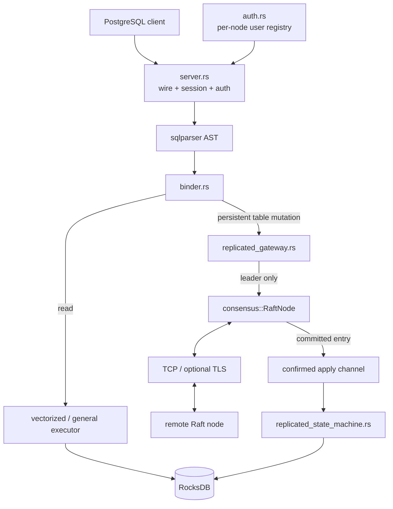
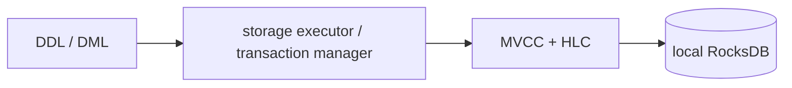

# Architecture

NeuralBase combines a local SQL engine with a Raft consensus subsystem and, in configured fixed-membership clusters, a deterministic replicated state machine for persistent table mutations.

## Design principles

- **Explicit semantics over fallback.** Invalid clustered durability/catalog/persistence prerequisites fail closed.
- **Bounded work.** General query execution rejects pathological intermediate growth.
- **Evidence-scoped claims.** Architecture names do not imply guarantees that tests do not exercise.
- **Replicated mutation effects are concrete.** Followers do not re-plan `UPDATE`/`DELETE` predicates.
- **Append is not acknowledgement.** Normal replicated SQL success waits for quorum commit plus confirmed durable local apply.
- **Local reads remain local.** This phase does not claim linearizable arbitrary-follower reads.
- **Backpressure is intentional, deadlock is not.** Confirmed apply is bounded and shutdown-safe.

## High-level flow

## SQL front end and reads

The server accepts PostgreSQL-protocol connections, handles authentication/session state, parses SQL, binds referenced objects, and routes statements into the available execution paths.

`SELECT` execution remains local to the connected node. Follower reads can lag committed state because this phase does not implement Raft read-index/lease semantics.

## Single-node mutation path

Without `NEURALBASE_NODE_ID`, persistent table DDL/DML keeps the historical local storage behavior:

This preserves backward-compatible single-node behavior.

## Clustered persistent table mutation path

Configured cluster mode requires `NEURALBASE_NODE_ID` and durable RocksDB storage.

Before a persistent table mutation is bound/materialized, the gateway commits a current-term readiness barrier and waits for confirmed apply. This closes the newly-elected-leader race where the Raft log is current but the local SQL state machine has not yet applied preceding committed entries.

Mutation materialization/proposal is serialized on the leader. Current replicated command classes are:

- `CREATE TABLE`
- `DROP TABLE`
- `INSERT`
- `UPDATE`
- `DELETE`

`INSERT` carries concrete encoded rows and deterministic generated keys. `UPDATE`/`DELETE` scan the leader's confirmed-applied state, evaluate predicates once, and replicate concrete replacement rows or primary keys. Followers apply those effects directly.

## Replicated command and state-machine layers

`src/replicated_sql.rs` defines the versioned binary command format. It uses explicit magic/version/opcodes, big-endian integer encoding, bounded length-prefixed fields, canonical DML key ordering, and rejection of ambiguous/non-canonical encodings.

`src/replicated_state_machine.rs` applies committed commands. Its durable SQL apply marker records the highest applied SQL Raft index and replicated HLC high-water mark.

For a mutation, the state machine writes the SQL/catalog effect and apply marker in one RocksDB `WriteBatch`. On replay, indices at or below the durable marker are treated as already applied, avoiding duplicate MVCC versions.

## Raft client acknowledgement

Normal `ClientCommand` replies are not completed at local append.

The leader:

1. appends/persists the command;
2. replicates it;
3. advances `commit_index` only according to Raft quorum rules;
4. delivers committed entries to the confirmed apply consumer in order;
5. waits for the state machine's completion result;
6. advances `last_applied` only after successful apply;
7. then resolves the corresponding client success.

Apply failure, persistence failure, transport shutdown, or leadership loss cannot be converted into a false SQL success.

Legacy membership/administrative commands remain outside the replicated-SQL guarantee and are not promoted to production-safe membership operations by this phase.

## Consensus stable storage

`src/raft_persistence.rs` stores Raft persistent state in RocksDB's metadata column family. `RaftNode` fail-stops on required persistence load/save errors. `FailClosedPersistenceStore` remains a defense-in-depth adapter and explicit invariant boundary, not the only safety mechanism.

## Authentication state

`src/auth.rs` owns the user registry. `CREATE USER`, `ALTER USER`, and `DROP USER` persist to `NEURALBASE_USERS_FILE` but remain per node. They are not part of the replicated table state machine in this phase.

## Snapshot boundary

Legacy Raft snapshot bytes are opaque to the SQL engine. Replicated-SQL mode therefore rejects legacy compaction and refuses startup from persisted opaque snapshot state rather than truncating history without a reconstructable SQL snapshot.

A versioned SQL-aware snapshot/bootstrap/node-replacement protocol is required before enabling compaction in this mode.

## Deployment architecture

Compose, Kubernetes, and Helm instantiate fixed-membership processes with explicit peer mappings and independent persistent volumes. Kubernetes uses StatefulSet identity; automatic HPA is rejected because scaling replicas does not perform a Raft membership transition.

## Module map

- `src/main.rs` — process bootstrap, durable clustered prerequisites, Raft/apply startup and shutdown.
- `src/server.rs` — PostgreSQL protocol/session/query dispatch and local user DDL.
- `src/replicated_gateway.rs` — leader readiness, mutation serialization/materialization and proposal.
- `src/replicated_sql.rs` — deterministic versioned mutation codec.
- `src/replicated_state_machine.rs` — deterministic/idempotent RocksDB apply.
- `src/raft_persistence.rs` — RocksDB-backed Raft stable storage.
- `src/consensus/` — Raft protocol, transport, confirmed apply and lifecycle.
- `src/storage.rs`, `src/mvcc.rs` — RocksDB/MVCC storage semantics.
- `tests/replicated_sql_process.rs` — independent-process failover/restart evidence.

## Current acceptance boundary

Executable evidence now supports fixed-membership replicated persistent table mutations. Stronger HA claims still require SQL-aware snapshot/bootstrap, node replacement, coordinated membership changes, a replicated/strongly consistent auth design, defined read-consistency modes, and operator recovery/backup workflows.
