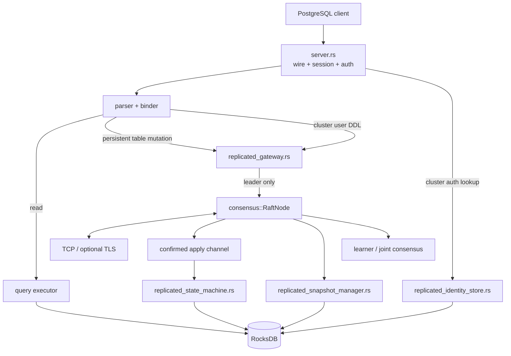

# Architecture

NeuralBase combines a local SQL engine with a Raft consensus subsystem and deterministic replicated state machines for persistent table mutations and clustered identity. SQL-aware snapshots preserve the same authoritative replicated state across compaction, recovery and learner bootstrap.

## Design principles

- **Explicit semantics over fallback.** Invalid clustered durability, persistence, snapshot, membership or identity prerequisites fail closed.
- **Append is not acknowledgement.** Replicated success waits for quorum commit plus confirmed durable local apply.
- **Concrete replicated effects.** Followers do not re-plan `UPDATE`/`DELETE` predicates.
- **No plaintext identity log commands.** Cluster user passwords are converted to SCRAM verifier material before proposal.
- **One replicated durability lifecycle.** Identity shares the same apply cursor and snapshot lifecycle as replicated SQL.
- **Snapshot before truncation; restore before ACK.** Compaction/recovery ordering is explicit.
- **Membership is a consensus operation.** Learners do not vote; promotion/removal use coordinated configuration changes.
- **Local reads remain local.** Arbitrary follower reads are not claimed linearizable.

## High-level flow

## Standalone versus clustered identity

Without `NEURALBASE_NODE_ID`, table and user DDL retain the historical local behavior, including the writable local `users.json` registry.

With clustered mode enabled, `CREATE USER`, `ALTER USER`, and `DROP USER` route through the replicated gateway. The leader derives SCRAM keys before proposal. `src/replicated_identity.rs` defines a versioned command format that cannot encode plaintext passwords or PostgreSQL MD5 verifier material.

Cluster authentication reads `ReplicatedIdentityState` from RocksDB rather than the process-local registry. Identity mutations and the replicated apply cursor are written atomically in one RocksDB batch.

## Legacy identity migration

`users.json` is not a live clustered authority. It may be used only as an explicit migration source while replicated identity is uninitialized. The operator must supply `NEURALBASE_IDENTITY_MIGRATION_SHA256` matching the exact file selected as authoritative. The strict parser accepts SCRAM records only and rejects malformed input, duplicates, MD5 material and digest mismatch.

A fresh auth-disabled cluster with no legacy file may initialize replicated identity with its first `CREATE USER`. An auth-required fresh cluster needs existing replicated identity or an explicitly authorized migration source.

## Replicated table mutation path

Before state-dependent mutation materialization, the leader commits a current-term readiness barrier and waits for confirmed apply. Current table classes are `CREATE TABLE`, `DROP TABLE`, `INSERT`, `UPDATE`, and `DELETE`; `UPDATE`/`DELETE` replicate concrete row/key effects.

## State-machine and acknowledgement boundary

`src/replicated_state_machine.rs` distinguishes table, identity and Raft-control entries while advancing one durable apply cursor. Table/identity effects and cursor movement are crash-safe and replay-idempotent.

Normal client success is not resolved at local append. The leader persists, replicates, quorum-commits, applies in order, confirms durable state-machine completion, then replies.

## SQL-aware snapshot architecture

`src/replicated_snapshot.rs` owns a versioned logical snapshot envelope. `src/replicated_snapshot_manager.rs` exports/restores durable catalog/data/apply/HLC state and the replicated identity extension from a consistent storage point.

Snapshot creation is validated and durably staged before prefix truncation. Follower InstallSnapshot validates/stages/restores state before the Raft snapshot boundary is durably published and acknowledged. Interrupted installation resumes idempotently after restart.

Identity therefore survives compaction, empty-storage reconstruction and learner catch-up through the same mechanism as table state.

## Coordinated membership

`src/consensus/membership.rs` represents voter/learner/joint configurations. A new node starts as a learner with a seed view, acquires state via log/snapshot catch-up, and cannot vote or become leader until promoted. Promotion enters joint old/new voter configuration and finalizes after the required quorums. Removal uses the same safety model, and the current leader must transfer leadership before removal.

Finalized membership is durable and overrides stale bootstrap peer configuration after restart. Removed identities are tombstoned so a stale disk cannot silently rejoin as a voter.

This capability does not automatically reconcile Kubernetes replicas; deployment orchestration remains separate.

## Read-consistency boundary

`SELECT` reads local applied state. Fresh/reconstructing members have a serving-readiness gate, but normal follower reads may still lag committed state because there is no ReadIndex/lease-based linearizable read mode.

## Module map

- `src/server.rs` — PostgreSQL protocol/session/auth and statement routing.
- `src/replicated_gateway.rs` — leader readiness, materialization, table/user proposal and confirmed acknowledgement.
- `src/replicated_sql.rs` — deterministic table mutation codec.
- `src/replicated_identity.rs` / `replicated_identity_store.rs` — deterministic verifier-only identity codec and authority.
- `src/replicated_identity_migration.rs` / `replicated_identity_runtime.rs` — strict legacy migration and clustered lookup.
- `src/replicated_state_machine.rs` — deterministic/idempotent RocksDB apply.
- `src/replicated_snapshot*.rs` — logical snapshot codec, export/restore and Raft hooks.
- `src/consensus/membership.rs` / `src/consensus/raft.rs` — Raft, learners and joint-consensus lifecycle.
- `src/raft_persistence.rs` — RocksDB-backed Raft stable state and staged snapshots.

## Current acceptance boundary

Executable evidence supports replicated persistent tables, SQL-aware snapshot/recovery, coordinated membership changes and replicated SCRAM identity. Stronger production claims still require defined stronger read consistency, operator-facing backup/disaster recovery, automated deployment membership reconciliation, broader security/authorization, chaos/upgrade validation and production performance characterization.
