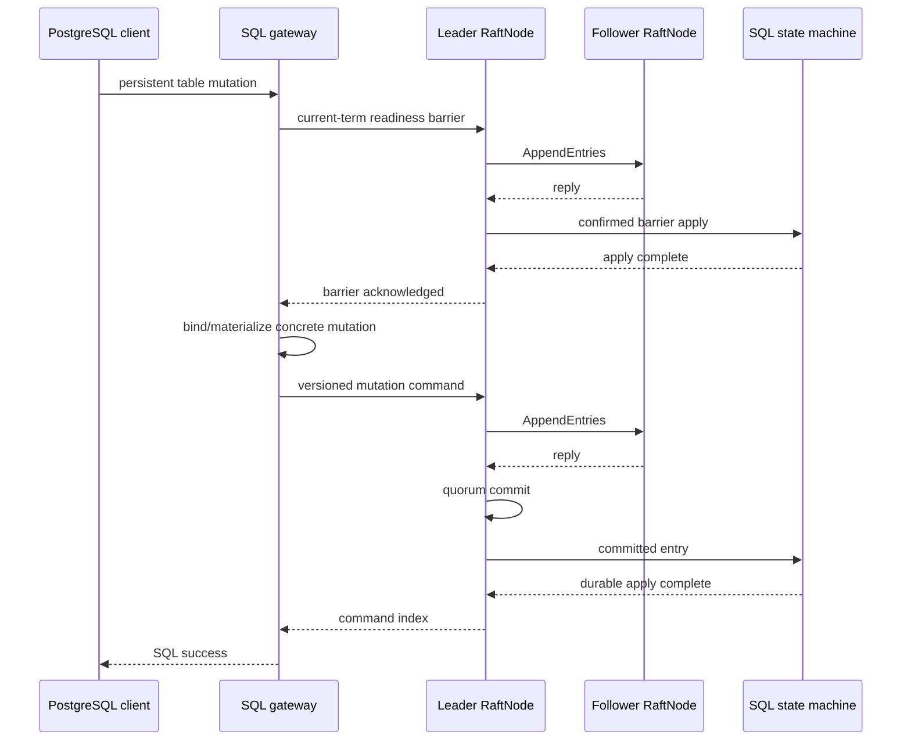

# Distributed semantics

NeuralBase now has a tested fixed-membership replicated state-machine path for persistent table mutations. This document defines that path and, equally importantly, the boundaries that remain outside it.

## Node identity and durable clustered startup

A Raft node has a **logical ID** and a **connectable address**. They are separate concepts.

Preferred configuration:

```bash
NEURALBASE_NODE_ID=node1
NEURALBASE_DB_PATH=/var/lib/neuralbase
NEURALBASE_RAFT_ADDR=0.0.0.0:7001
NEURALBASE_PEERS='node2=node2.internal:7001,node3=node3.internal:7001'
```

Accepted peer forms include explicit `id=address` mappings and legacy shorthand. Explicit mapping is preferred because it removes ambiguity between protocol identity and DNS/socket routing.

Clustered startup is fail-closed for persistent SQL prerequisites:

- `NEURALBASE_NODE_ID` requires `NEURALBASE_DB_PATH`/`DB_PATH`;
- persisted SQL catalog hydration errors abort clustered startup;
- required Raft stable-storage load/save failures fail-stop the Raft node.

Without `NEURALBASE_NODE_ID`, NeuralBase retains its single-node local DDL/DML behavior.

## Transport implementations

- `ChannelTransport` — in-process/test use.
- `TcpTransport` — real multi-process framed TCP transport.
- `TlsTcpTransport` — feature-gated encrypted/authenticated transport.

The process-level replicated SQL test uses real OS processes, real PostgreSQL connections, real TCP Raft transport, distinct ports, and distinct RocksDB directories.

## Replicated mutation flow



For ordinary replicated SQL commands, append-only local logging is not success. The client reply is withheld until the command reaches quorum commit and the acknowledging node's state machine confirms apply.

## Deterministic mutation model

Replicated table commands use an explicit versioned binary representation rather than re-running SQL on followers.

Current replicated mutation classes:

- `CREATE TABLE`
- `DROP TABLE`
- `INSERT`
- `UPDATE`
- `DELETE`

DML commands carry a leader-chosen commit timestamp and concrete primary-key/value effects. Canonical ordering is enforced for row/key collections.

`UPDATE` and `DELETE` are materialized on the leader: the predicate is evaluated against the leader's confirmed-applied state and the concrete replacement rows or delete keys are replicated. Followers do not re-evaluate the predicate or choose row effects locally.

## Leader readiness and serialized mutation materialization

A newly elected leader can have committed entries in its Raft log before its local SQL state machine has caught up. Before persistent mutation binding/materialization, the gateway commits a current-term readiness barrier and waits for confirmed apply.

Mutating SQL is serialized through the leader-side gateway across readiness, materialization, proposal, commit, and apply acknowledgement. This prevents two concurrent mutations from independently deriving effects from the same stale pre-apply view.

## Follower behavior and client retries

Followers reject persistent table mutations before proposal. The PostgreSQL error uses SQLSTATE `25006`; the error includes the known leader ID when available.

That explicit follower rejection is a pre-submit outcome and is safe to redirect/retry against the current leader.

A failure or timeout after submission to a leader is different: its outcome is **uncertain**. The former leader may have replicated the entry to a quorum before the client saw the connection/error result. A non-idempotent statement must not be blindly replayed solely because success was not observed.

## Deterministic apply and replay

Committed SQL commands are applied in Raft log order.

The replicated SQL state machine:

- validates command version/shape and table identity;
- writes exact DML bytes at the leader-chosen HLC timestamp;
- applies catalog/table changes deterministically;
- writes the SQL effect and durable apply marker in one RocksDB `WriteBatch`;
- treats already-applied Raft indices as replay/idempotence hits rather than creating duplicate MVCC versions;
- restores the replicated HLC high-water mark from durable apply state after restart.

A state-machine apply error fails the confirmed apply path instead of returning SQL success.

## Stable Raft persistence

Raft term, vote, log, snapshot-boundary metadata, and snapshot bytes are persisted through the RocksDB-backed persistence store.

Required persistence load/save failures are fail-stop events in `RaftNode` itself. The runtime also installs `FailClosedPersistenceStore` as defense in depth. Consensus does not log a required persistence failure and continue as though state were durable.

Injected failure tests exercise startup load failure and mid-command save failure and require that no SQL/normal-client success escape the failed node.

## Process failover and restart evidence

`tests/replicated_sql_process.rs` starts three independent NeuralBase processes and exercises:

1. `CREATE TABLE`;
2. multi-row `INSERT`;
3. `UPDATE`;
4. `DELETE`;
5. convergence on all three independent RocksDB stores;
6. leader kill;
7. a write through the newly elected leader;
8. restart/catch-up of the killed node;
9. full-cluster stop/start from persisted state;
10. another write after restart;
11. a PostgreSQL write raced against `SIGKILL` of the leader;
12. the one-way durability rule that any client-observed success remains visible through the surviving quorum;
13. further mutation and convergence after crash recovery.

This is evidence for the checked fixed-membership failure model, not a proof of arbitrary partition/Byzantine/storage-corruption behavior.

## Read consistency boundary

Reads are not routed through a Raft read-index/lease protocol in this phase. A follower serves its local applied state and can lag the leader/commit frontier.

Therefore:

- arbitrary follower reads are not claimed linearizable;
- a just-acknowledged write need not be immediately visible on every follower until that follower learns/applies the commit;
- the process tests wait for convergence where follower visibility is part of the assertion.

## Snapshot and compaction safety boundary

The legacy Raft snapshot payload is opaque and is not a complete NeuralBase SQL/catalog snapshot. Using that mechanism to truncate replicated SQL history could make a restarted/replacement node advance its Raft snapshot boundary without reconstructing table state.

For that reason, replicated-SQL mode currently:

- rejects legacy compaction commands; and
- refuses startup from a persisted opaque Raft snapshot.

This is intentional fail-closed behavior. SQL-aware snapshot/bootstrap and node replacement are future work.

## Authentication boundary

`CREATE USER`, `ALTER USER`, and `DROP USER` remain per-node credential-registry mutations. They are not part of the replicated table-mutation command model in this phase.

Operators must not infer cluster-wide identity consistency from table replication.

## Fixed membership and deployment

Checked-in Compose/Kubernetes/Helm topologies use fixed membership. HPA enablement is rejected because changing StatefulSet replica count is not a Raft membership change.

The PodDisruptionBudget preserves a configured majority of pods as an availability aid, but it is not a membership controller.

## What is implemented versus still open

Implemented/tested for configured fixed-membership clusters:

- deterministic persistent table mutation commands;
- explicit follower write rejection;
- leader readiness barrier;
- concrete leader-side UPDATE/DELETE materialization;
- quorum commit + confirmed apply before SQL success;
- deterministic/idempotent RocksDB apply;
- durable/fail-closed Raft persistence;
- separate-process convergence, leader failover, catch-up, restart, and crash-race evidence.

Still open before stronger HA/production claims:

- SQL-aware snapshots/bootstrap and node replacement;
- coordinated dynamic membership;
- replicated auth/user state;
- stronger/linearizable read modes;
- backup/restore and disaster recovery;
- broader partition/chaos evidence and production operations validation.

NeuralBase should therefore be described as an experimental SQL engine with a tested **fixed-membership replicated persistent table-mutation path**, not as a production-ready HA database.
