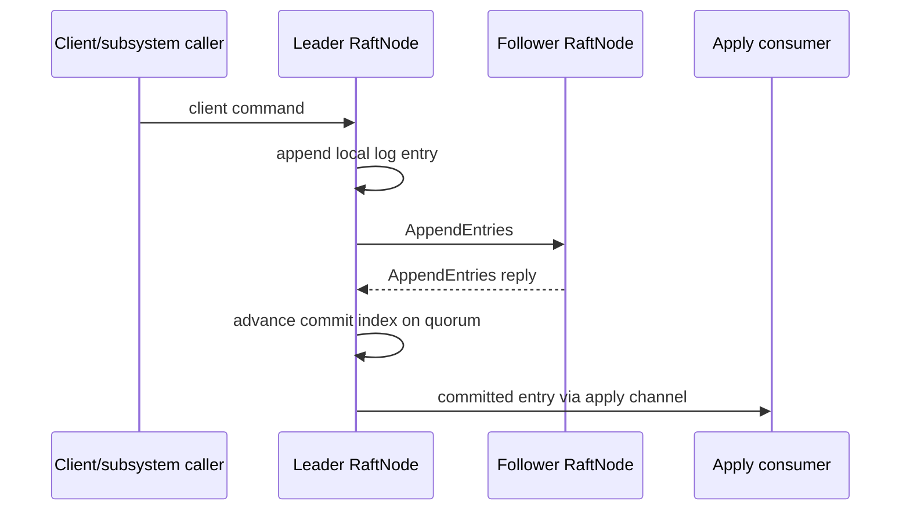
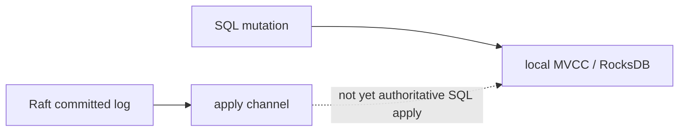

# Distributed semantics

NeuralBase contains a real Raft consensus subsystem, but the current SQL engine is not yet a Raft-replicated state machine. This document defines that boundary precisely.

## Node identity and transport addresses

A Raft node has a **logical ID** and a **connectable address**. They are not interchangeable.

Preferred configuration:

```bash
NEURALBASE_NODE_ID=node1
NEURALBASE_RAFT_ADDR=0.0.0.0:7001
NEURALBASE_PEERS='node2=node2.internal:7001,node3=node3.internal:7001'
```

Accepted peer forms include:

```text
node2=node2.internal:7001,node3=node3.internal:7001
node2:7001,node3:7001
node2,node3
```

Explicit `id=address` mapping is preferred because it removes ambiguity between protocol identity and DNS/socket routing.

Duplicate or malformed logical IDs should fail startup rather than silently producing isolated clusters.

## Transport implementations

The consensus layer has multiple transport implementations for different purposes:

- `ChannelTransport` — in-process/test use.
- `TcpTransport` — real multi-process framed TCP transport.
- `TlsTcpTransport` — feature-gated encrypted/authenticated transport.

Production-like process topologies use TCP/TLS, not a newly created in-process channel bus.

## Raft lifecycle

At a high level:



The apply channel represents committed state-machine work waiting to be consumed.

## Backpressure and shutdown

The apply channel is bounded. A slow consumer is therefore allowed to apply backpressure rather than causing unbounded memory growth.

A full channel must not make process shutdown impossible. The Raft task's apply send is interruptible by shutdown, so a blocked `send().await` cannot deadlock `shutdown().await` indefinitely.

If the apply receiver is permanently closed, the Raft task fail-stops rather than pretending committed entries were applied successfully.

## What Raft currently guarantees

Within the Raft subsystem, the code and tests cover protocol behavior such as election, replication, snapshots/membership machinery, transport routing, and committed-entry delivery.

Those guarantees apply to the **Raft log/subsystem**.

## What Raft does not currently guarantee for SQL

A successful SQL `INSERT`, `UPDATE`, `DELETE`, or DDL statement is not currently equivalent to a committed Raft command.



Consequences:

- peer nodes can have different SQL data;
- a Raft leader change does not imply SQL failover;
- quorum availability does not prove SQL data availability;
- local RocksDB durability does not equal majority durability;
- per-node user registry changes are not replicated automatically.

## Stable persistence boundary

Raft has persistence abstractions, but stable-storage failure handling remains a hardening target. A production database should not continue as if consensus state were durable after a required persistence operation fails.

The roadmap therefore treats **fail-closed Raft persistence** as a release boundary, not an optional optimization.

## Fixed membership in deployment

The checked-in Kubernetes/Helm topology uses fixed membership assumptions. HorizontalPodAutoscaler is deliberately rejected because scaling a StatefulSet replica count does not itself perform a Raft joint-consensus membership change.

The PodDisruptionBudget is derived from the configured replica count to preserve a majority of pods, but a PDB is an availability aid, not a consensus-membership controller.

## Required path to replicated SQL

A credible replicated SQL design should include all of the following:

1. **Deterministic mutation representation.** SQL effects must be encoded into deterministic commands independent of local parser/planner nondeterminism.
2. **Leader routing.** Mutating requests must have explicit leader/follower behavior.
3. **Commit semantics.** A client success response must be tied to the chosen durability point, normally quorum commit plus required local apply.
4. **Deterministic apply.** Every member applies the same committed command to the same logical state.
5. **Idempotence/replay.** Recovery and log replay must not duplicate effects.
6. **Schema/auth replication.** Catalog and credential mutations must participate in the same state model or have equally explicit semantics.
7. **Crash/restart proof.** Separate-process tests must show state convergence after kill/restart.
8. **Leader-failover proof.** A new leader must expose the previously acknowledged SQL state.
9. **Membership workflow.** Adds/removals must use coordinated consensus membership changes.

Until those acceptance conditions exist, NeuralBase should be described as a local SQL engine with an integrated Raft subsystem, not a replicated SQL database.
